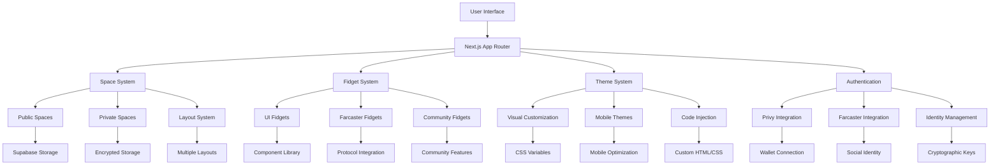

# Architecture Overview

Nounspace is built on a modern, modular architecture that combines Next.js App Router with Zustand state management, creating a highly customizable Farcaster client experience.

## High-Level Architecture



## Core Principles

### 1. Modularity
- **Component-based architecture** with atomic design principles
- **Fidget system** for extensible mini-applications
- **Theme system** for visual customization
- **Space system** for organizational structure

### 2. State Management
- **Zustand stores** for efficient state management
- **Store composition** for complex state relationships
- **Optimistic updates** for better user experience
- **Persistence** with selective storage strategies

### 3. Authentication
- **Privy integration** for wallet-based authentication
- **Farcaster integration** for social identity
- **Multi-identity support** with cryptographic keys
- **Authenticator system** for service access

### 4. Customization
- **Theme system** for visual personalization
- **Layout system** for multiple layout support
- **Fidget system** for functional customization
- **Mobile optimization** for responsive design

## System Components

### 1. Frontend Layer
- **Next.js App Router** - Modern React framework
- **TypeScript** - Type-safe development
- **Tailwind CSS** - Utility-first styling
- **Framer Motion** - Animation library

### 2. State Management Layer
- **Zustand** - Lightweight state management
- **Store composition** - Modular store architecture
- **Persistence** - Local storage integration
- **Optimistic updates** - Immediate UI feedback

### 3. Authentication Layer
- **Privy** - Wallet authentication
- **Farcaster** - Social protocol integration
- **Identity management** - Multi-identity support
- **Authenticator system** - Service access control

### 4. Data Layer
- **Supabase** - Database and storage
- **Encrypted storage** - Private data protection
- **Public storage** - Shared content
- **API integration** - External service access

### 5. Customization Layer
- **Theme system** - Visual customization
- **Layout system** - Multiple layout support
- **Fidget system** - Mini-application framework
- **Mobile system** - Responsive design

## Data Flow

### 1. User Interaction
```typescript
// User interacts with UI
const handleUserAction = (action: UserAction) => {
  // Update local state optimistically
  updateLocalState(action);
  
  // Sync with server
  syncWithServer(action);
};
```

### 2. State Updates
```typescript
// State updates flow through stores
const updateState = (newState: State) => {
  // Update store
  set((draft) => {
    Object.assign(draft, newState);
  }, "updateState");
  
  // Persist changes
  persistState(newState);
};
```

### 3. Server Synchronization
```typescript
// Sync with server
const syncWithServer = async (changes: Changes) => {
  try {
    await api.updateServer(changes);
  } catch (error) {
    // Rollback optimistic updates
    rollbackChanges(changes);
  }
};
```

## Security Architecture

### 1. Authentication Flow
```typescript
// Authentication flow
const authenticateUser = async () => {
  // 1. Connect wallet via Privy
  const wallet = await privy.connect();
  
  // 2. Create identity
  const identity = await createIdentity();
  
  // 3. Link Farcaster (optional)
  if (userWantsFarcaster) {
    await linkFarcaster(identity);
  }
  
  // 4. Initialize stores
  await initializeStores(identity);
};
```

### 2. Data Encryption
```typescript
// Encrypt sensitive data
const encryptData = async (data: any, key: string) => {
  const encrypted = await encrypt(data, key);
  return encrypted;
};

// Decrypt data
const decryptData = async (encryptedData: any, key: string) => {
  const decrypted = await decrypt(encryptedData, key);
  return decrypted;
};
```

### 3. Access Control
```typescript
// Check permissions
const checkPermission = (action: string, resource: string): boolean => {
  const permissions = getCurrentUserPermissions();
  return permissions[resource]?.includes(action) || false;
};
```

## Performance Architecture

### 1. Lazy Loading
```typescript
// Lazy load components
const LazyComponent = lazy(() => import('./Component'));

// Use with Suspense
const App = () => (
  <Suspense fallback={<Loading />}>
    <LazyComponent />
  </Suspense>
);
```

### 2. State Optimization
```typescript
// Optimize state updates
const useOptimizedState = (selector: (state: State) => any) => {
  return useStore(selector, shallow);
};
```

### 3. Caching Strategy
```typescript
// Cache expensive computations
const useMemoizedValue = (value: any) => {
  return useMemo(() => computeExpensiveValue(value), [value]);
};
```

## Development Architecture

### 1. Component Structure
```
src/
├── app/                    # Next.js App Router
│   ├── (spaces)/          # Space routes
│   ├── api/               # API routes
│   └── explore/           # Discovery routes
├── common/                # Shared components
│   ├── components/        # UI components
│   ├── data/              # State management
│   ├── lib/               # Utilities
│   └── providers/         # Context providers
├── fidgets/               # Mini-applications
├── constants/             # Application constants
└── styles/                # Global styles
```

### 2. State Management Structure
```
src/common/data/stores/
├── app/                   # Main app store
│   ├── accounts/          # Authentication & identity
│   ├── homebase/         # Private spaces (homebase)
│   ├── space/            # Public spaces
│   ├── currentSpace/     # Current space context
│   ├── checkpoints/      # State snapshots
│   ├── chat/             # Chat functionality
│   └── setup/            # Onboarding flow
├── createStore.ts        # Store utilities
└── types.ts              # Type definitions
```

### 3. Component Architecture
```
src/common/components/
├── atoms/                 # Basic components
├── molecules/             # Composite components
├── organisms/             # Complex components
└── templates/             # Page templates
```

## Integration Points

### 1. External Services
- **Privy** - Authentication
- **Farcaster** - Social protocol
- **Supabase** - Database and storage
- **Neynar** - Farcaster API
- **Alchemy** - Blockchain data

### 2. Internal Systems
- **Space System** - Content organization
- **Fidget System** - Mini-applications
- **Theme System** - Visual customization
- **Layout System** - Multiple layouts
- **Mobile System** - Responsive design

## Scalability Considerations

### 1. Store Architecture
- **Modular stores** for independent scaling
- **Store composition** for complex relationships
- **Selective persistence** for performance
- **Optimistic updates** for responsiveness

### 2. Component Architecture
- **Atomic design** for reusability
- **Lazy loading** for performance
- **Memoization** for optimization
- **Error boundaries** for reliability

### 3. Data Architecture
- **Encrypted storage** for privacy
- **Public storage** for sharing
- **Caching strategies** for performance
- **Sync mechanisms** for consistency

## Future Architecture

### 1. Planned Enhancements
- **Enhanced permission system** for fine-grained access control
- **Advanced theme system** with animation support
- **Fidget marketplace** for community fidgets
- **Collaboration features** for shared spaces

### 2. Technical Improvements
- **Performance monitoring** for optimization
- **Advanced caching** for better UX
- **Real-time updates** for collaboration
- **Mobile optimization** for better performance

### 3. Integration Opportunities
- **Additional protocols** for broader compatibility
- **Enhanced authentication** for better security
- **Advanced customization** for power users
- **Community features** for social interaction
