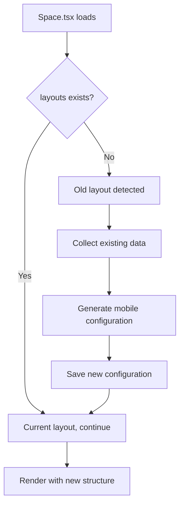

# Layout Migration Guide

## Overview

This document details the migration process from the single layout system to the multiple layouts system.

## Before vs After

### Old System (Before)

```typescript
interface LayoutFidgetDetails {
  fidgetInstanceIds: string[];
  // Only desktop configurations
}
```

**Characteristics:**

- Single layout for all screens
- Mobile order configuration stored in each individual fidget
- No native support for different devices
- Feed always present in all contexts

### New System (After)

```typescript
interface LayoutFidgetDetails {
  fidgetInstanceIds: string[];  // Maintained for compatibility
  layouts?: {                   // New configuration
    mobile: {
      fidgetOrder: string[];
      feedEnabled: boolean;
    };
  };
}
```

**Characteristics:**

- Centralized configuration per device type
- Automatic migration system
- Contextual feed (only in homebase)
- Separation of Concerns implemented

## Automatic Migration Process

### 1. Old Layout Detection

```typescript
// In Space.tsx
const needsMigration = !config.layoutDetails.layouts;

if (needsMigration) {
  // Execute migration
}
```

### 2. Existing Data Collection

```typescript
const collectExistingMobileOrder = (fidgetInstanceDatums) => {
  return Object.entries(fidgetInstanceDatums)
    .map(([id, datum]) => ({
      id,
      order: datum.config?.settings?.mobileOrder || 0
    }))
    .sort((a, b) => a.order - b.order)
    .map(item => item.id);
};
```

### 3. New Configuration Generation

```typescript
const generateMobileLayout = (fidgetInstanceDatums, pathname) => {
  return {
    fidgetOrder: collectExistingMobileOrder(fidgetInstanceDatums),
    feedEnabled: pathname === '/homebase'
  };
};
```

### 4. Update and Save

```typescript
const migratedLayoutDetails = {
  ...existingLayoutDetails,
  layouts: {
    mobile: generateMobileLayout(fidgetInstanceDatums, pathname)
  }
};

saveLayoutDetails(migratedLayoutDetails);
```

## Files Modified in PR #1279

### Main Modified Files

1. **`src/app/(spaces)/Space.tsx`**
   - Added detection and migration system
   - Implemented Separation of Concerns
   - Removed `showFeedOnMobile` prop
   - Added sorting by mobile order

2. **`src/app/(spaces)/MobileViewSimplified.tsx`** (New)
   - Replaced complex `MobileView.tsx`
   - Simplified component focused only on rendering
   - Uses existing layout system

3. **`src/common/lib/theme/ThemeSettingsEditor.tsx`**
   - Implemented contextual feed management
   - Removed `NogsGateButton`
   - Updated to use new data structure

4. **`src/common/utils/layoutUtils.ts`**
   - Added support for explicit mobile order
   - Implemented feed injection logic

5. **`src/fidgets/layout/tabFullScreen/index.tsx`**
   - Added `isHomebasePath` prop
   - Updated tab ordering logic
   - Simplified CSS and containers

### Support Files

6. **`src/common/components/organisms/MobileNavbar.tsx`**
   - Current component for mobile navigation, replaces the old TabNavigation

7. **`src/common/components/organisms/MobileSettings.tsx`**
   - Updated draggable component key

## Backward Compatibility

### Existing Spaces

- **Automatic Detection**: System detects old layouts automatically
- **Transparent Migration**: User doesn't notice the migration
- **Data Preservation**: All existing configurations are maintained
- **No Loss**: No functionality is lost in the process

### Preserved Data

```typescript
// Data that is maintained during migration
{
  fidgetInstanceIds: [...],     // Kept exactly the same
  data: {...},                  // Preserved
  customCSS: "...",            // Preserved
  // All other existing fields are maintained
  
  // Only added:
  layouts: {
    mobile: {...}              // New, based on existing data
  }
}
```

## Migration Detection Flow

### During Loading



### Data States

1. **Initial State**: Old layout loaded from database
2. **Transition State**: Migration being executed
3. **Final State**: Migrated layout in use
4. **Persisted State**: Data saved in new format

## Points of Attention

### During Migration

- ⚠️ **SSR**: Migration may not be complete on server
- ⚠️ **Cache**: Cached data may be in old format
- ⚠️ **Performance**: Migration only happens once per space

### After Migration

- ✅ **Consistency**: All data is in new format
- ✅ **Performance**: No migration overhead
- ✅ **Functionality**: All features work normally

## Testing and Validation

### Test Scenarios

1. **New Space**: Created already in current format
2. **Old Space**: Migrated automatically
3. **Mixed Space**: Some data migrated, others not
4. **Edge Cases**: Corrupted or incomplete data

### Validation

```typescript
// Check if migration was successful
const validateMigration = (layoutDetails) => {
  return (
    layoutDetails.layouts &&
    layoutDetails.layouts.mobile &&
    Array.isArray(layoutDetails.layouts.mobile.fidgetOrder)
  );
};
```

## Rollback (If Necessary)

### Rollback Strategy

If it's necessary to revert changes:

1. **Data**: Old layouts are still preserved in `fidgetInstanceIds`
2. **Code**: Revert to previous components
3. **Functionality**: Old system can be restored

### Preservation during Rollback

```typescript
// Original data is always available
const originalLayout = layoutDetails.fidgetInstanceIds;
const mobileOrders = Object.values(fidgetInstanceDatums)
  .map(d => d.config?.settings?.mobileOrder);
```

## Monitoring

### Metrics to Track

- Successful migration rate
- Performance during migration
- Migration errors
- Loading time after migration

### Important Logs

```typescript
// Logs for monitoring
console.log('Migration started for space:', spaceId);
console.log('Data before:', oldLayoutDetails);
console.log('Data after:', newLayoutDetails);
console.log('Migration completed in:', migrationTime);
```
