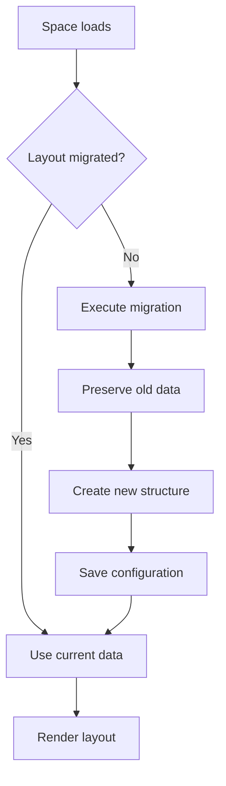
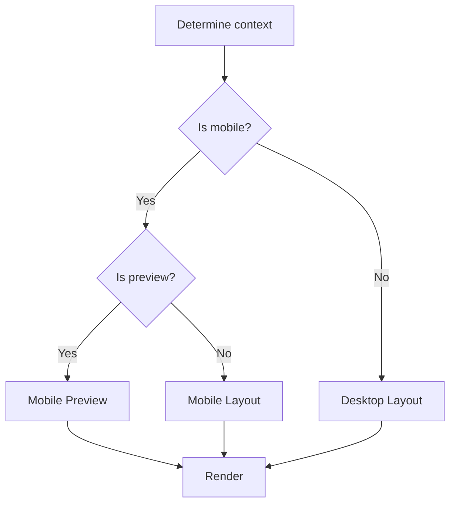
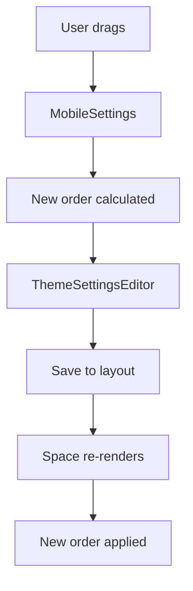

# Multiple Layouts System Documentation

## Introduction

This documentation covers the multiple layouts system, which introduced support for different layout configurations for desktop and mobile, applying the Separation of Concerns (SoC) principle and implementing significant improvements to the mobile experience.

## 📚 Available Documents

### 1. [Multiple Layouts System](./multiple-layouts-system-en.md)
**Main document** explaining the architecture of the new layouts system.

**Content:**
- Architecture and Separation of Concerns
- LayoutFidgetDetails data structure
- Layout decision flow
- Automatic migration system
- Code transition points

**When to consult:** To understand the general architecture and how the system works.

### 2. [Layout Migration Guide](./layout-migration-guide-en.md)
**Detailed guide** on how old layouts are migrated to the new system.

**Content:**
- Before vs after comparison
- Automatic migration process
- Files modified in the PR
- Backward compatibility
- Rollback strategies

**When to consult:** To understand how existing data is preserved and migrated.

### 3. [Mobile Drag-and-Drop System](./mobile-drag-drop-system-en.md)
**Technical documentation** of the mobile fidget reordering system.

**Content:**
- Complete drag-and-drop flow
- Interface and involved components
- Edge case handling
- Performance and optimizations
- Debugging and troubleshooting

**When to consult:** To understand or modify the drag-and-drop system.

### 4. [Immutable Homebase Feed System](./immutable-homebase-feed-en.md)
**Specific documentation** about the contextual homebase feed.

**Content:**
- Immutable feed concept and implementation
- Lifecycle and automatic management
- Integration with the layouts system
- Special behaviors and edge cases

**When to consult:** To understand how the feed works specifically in homebase.

## 🎯 Main Implemented Changes

### Summary of Improvements

1. **Separation of Concerns (SoC)**
   - Layout controllers separated from layout presenters
   - Well-defined responsibilities between components
   - Easier maintenance and extensibility

2. **Functional Drag-and-Drop System**
   - Fixed the issue where drag didn't update order
   - Centralized ordering in layout instead of individual
   - Optimized performance with memoization

3. **Immutable Contextual Feed**
   - Feed appears only in homebase (`/homebase`)
   - Automatic creation and management
   - Doesn't interfere with other contexts

4. **Automatic Migration**
   - Old layouts are migrated automatically
   - Total preservation of existing data
   - Transparent process for users

### Main Modified Files

```text
Core Components:
├── src/app/(spaces)/Space.tsx                 # Main controller
├── src/app/(spaces)/MobileViewSimplified.tsx  # Simplified mobile layout
└── src/app/(spaces)/SpacePage.tsx            # Entry point

State Management:
├── src/common/lib/theme/ThemeSettingsEditor.tsx  # State management
└── src/common/utils/layoutUtils.ts               # Layout utilities

Layout System:
├── src/fidgets/layout/tabFullScreen/index.tsx           # Main layout
└── src/fidgets/layout/tabFullScreen/components/         # Layout components
    └── MobileNavbar.tsx

Mobile Interface:
├── src/common/components/organisms/MobileSettings.tsx   # Drag interface
└── src/common/components/organisms/MobileNavbar.tsx     # Mobile navigation
```

## 🔄 How the System Works

### 1. Detection and Migration



### 2. Layout Selection



### 3. Drag-and-Drop Flow



## 🛠️ For Developers

### Key Points to Watch

1. **Always check migration**
   ```typescript
   // Old layouts may still exist
   const needsMigration = !layoutDetails.layouts;
   ```

2. **Use migrated data**
   ```typescript
   // Always use current configuration after Space.tsx
   const mobileOrder = layoutDetails.layouts.mobile.fidgetOrder;
   ```

3. **Contextual feed**
   ```typescript
   // Feed should only appear in homebase
   const shouldShowFeed = pathname === '/homebase';
   ```

### Code Patterns

```typescript
// ✅ Good: Separation of Concerns
<MobileLayout 
  data={processedData}
  onOrderChange={handleOrderChange}
/>

// ❌ Bad: Layout doing business logic
<MobileLayout 
  fidgetInstanceDatums={raw}
  onSave={rawSave}
/>
```

### Debugging

```typescript
// Useful logs for debug
console.log('Layout state:', {
  migrated: !!layoutDetails.layouts,
  mobileOrder: layoutDetails.layouts?.mobile?.fidgetOrder,
  feedEnabled: pathname === '/homebase'
});
```

## 🔧 Extensibility

### Adding New Layouts

```typescript
interface LayoutFidgetDetails {
  layouts?: {
    mobile: MobileLayout;
    tablet?: TabletLayout;     // Future
    desktop?: DesktopLayout;   // Future
    tv?: TVLayout;            // Future
  };
}
```

### New Feed Types

```typescript
interface FeedSystem {
  homebase: HomebaseFeed;
  community?: CommunityFeed;   // Future
  personal?: PersonalFeed;     // Future
}
```

## 📞 Support

### Common Issues

1. **Drag doesn't work**: Check if migration was executed
2. **Feed doesn't appear**: Confirm you're on `/homebase` path
3. **Order doesn't persist**: Check drag-and-drop callbacks
4. **Performance**: Check for excessive re-renders

### Additional Resources

- Consult specific documents for technical details
- Use debug logs for troubleshooting
- Check migration states in case of issues

---

**Author:** System implemented in PR #1279  
**Date:** July 2025  
**Version:** 1.0
