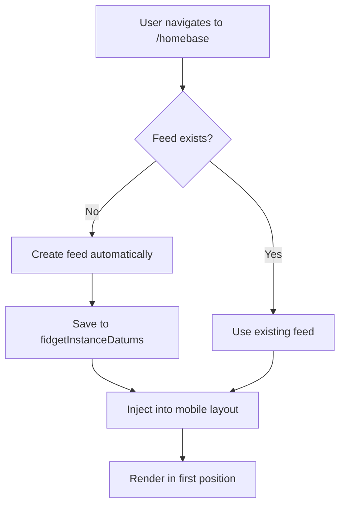

# Immutable Homebase Feed System

## Overview

This document explains the immutable feed system implemented specifically for the homebase context, including its automatic injection and contextual management.

## Immutable Feed Concept

### What is the Immutable Feed

The immutable feed is a special fidget that:

- Appears **only** in the `/homebase` path
- Is created and managed automatically by the system
- Cannot be removed or edited by the user
- Always appears as the first tab in mobile
- Displays homebase-specific content

### Difference from Normal Fidgets

| Characteristic | Normal Fidgets | Immutable Feed |
|----------------|----------------|----------------|
| **Creation** | Manual by user | Automatic by system |
| **Editing** | Allowed | Not allowed |
| **Removal** | Allowed | Not allowed |
| **Context** | Global | Only `/homebase` |
| **Ordering** | Configurable | Always first |

## Technical Implementation

### 1. Context Detection

```typescript
// In ThemeSettingsEditor.tsx
const pathname = usePathname();
const isHomebaseFeedTab = pathname === '/homebase';

useEffect(() => {
  if (isHomebaseFeedTab && !fidgetInstanceDatums['feed']) {
    // Create feed automatically
    createImmutableFeed();
  }
}, [isHomebaseFeedTab, fidgetInstanceDatums]);
```

### 2. Automatic Feed Creation

```typescript
const createImmutableFeed = () => {
  const feedFidget = {
    id: 'feed',
    fidgetType: 'feed',
    config: {
      editable: false,  // Immutable
      data: {},
      settings: {
        customMobileDisplayName: 'Feed',
        mobileIconName: 'FaBars',
        showOnMobile: true,
        mobileOrder: 0  // Always first
      }
    }
  };

  const newFidgetInstanceDatums = {
    ...fidgetInstanceDatums,
    feed: feedFidget
  };

  saveFidgetInstanceDatums(newFidgetInstanceDatums);
};
```

### 3. Mobile Layout Injection

```typescript
// In layoutUtils.ts
export const processTabFidgetIds = (
  fidgetIds: string[],
  isHomebasePath: boolean
): string[] => {
  let processedIds = [...fidgetIds];

  if (isHomebasePath && !processedIds.includes('feed')) {
    // Inject feed at the beginning
    processedIds.unshift('feed');
  }

  return processedIds;
};
```

### 4. Contextual Rendering

```typescript
// In TabNavigation.tsx
const shouldShowFeed = isHomebasePath && tabIds.includes('feed');

// Special handling for feed tab name
const getTabDisplayName = (tabId: string) => {
  if (tabId === 'feed') {
    return 'Feed';  // Fixed name
  }
  return fidgetInstanceDatums[tabId]?.config?.settings?.customMobileDisplayName || 'Unknown';
};
```

## Feed Lifecycle

### Creation



### Maintenance

- **Path change**: If user leaves `/homebase`, feed continues to exist but isn't displayed
- **Reload**: Feed is recreated automatically if needed
- **Synchronization**: Maintains consistency between sessions

### Cleanup

The feed is not automatically removed to maintain consistency, but can be cleaned in specific scenarios:

```typescript
const cleanupFeedIfNotHomebase = (pathname: string) => {
  if (pathname !== '/homebase' && fidgetInstanceDatums['feed']) {
    // Optional: remove feed if not in homebase
    const { feed, ...otherFidgets } = fidgetInstanceDatums;
    saveFidgetInstanceDatums(otherFidgets);
  }
};
```

## Integration with Layout System

### Mobile Layout

```typescript
// Feed is always the first item in mobile
const mobileLayout = {
  fidgetOrder: ['feed', ...otherFidgetIds],
  feedEnabled: true
};
```

### Desktop Layout

```typescript
// On desktop, feed can follow normal order
// or be treated specially as needed
```

### Tab Navigation

```typescript
// TabNavigation.tsx
const renderTabs = () => {
  return tabIds.map(tabId => {
    const isSpecialFeed = tabId === 'feed' && isHomebasePath;
    
    return (
      <Tab
        key={tabId}
        isActive={activeTabId === tabId}
        icon={isSpecialFeed ? 'FaBars' : getTabIcon(tabId)}
        label={isSpecialFeed ? 'Feed' : getTabLabel(tabId)}
        immutable={isSpecialFeed}
      />
    );
  });
};
```

## Special Behaviors

### 1. Fixed Icon

```typescript
const getFeedIcon = () => 'FaBars';  // Always the same icon
```

### 2. Fixed Name

```typescript
const getFeedLabel = () => 'Feed';  // Always the same name
```

### 3. Fixed Position

```typescript
const ensureFeedFirst = (tabIds: string[]) => {
  const withoutFeed = tabIds.filter(id => id !== 'feed');
  return ['feed', ...withoutFeed];
};
```

### 4. Non-Editable

```typescript
// Feed doesn't appear in editing interfaces
const editableFidgets = Object.entries(fidgetInstanceDatums)
  .filter(([id, fidget]) => id !== 'feed' && fidget.config.editable);
```

## States and Edge Cases

### Possible Scenarios

1. **First homebase access**: Feed is created automatically
2. **Return to homebase**: Feed already exists, is reused
3. **Navigation to other pages**: Feed stays hidden but persists
4. **Existing fidgets**: Feed is added without affecting other fidgets
5. **Non-migrated layout**: Feed works even in old layouts

### Error Handling

```typescript
const safeFeedCreation = () => {
  try {
    createImmutableFeed();
  } catch (error) {
    console.error('Error creating immutable feed:', error);
    // Fallback: continue without feed
  }
};
```

### State Validation

```typescript
const validateFeedState = () => {
  const isHomebase = pathname === '/homebase';
  const feedExists = !!fidgetInstanceDatums['feed'];
  const feedInLayout = mobileLayout?.fidgetOrder?.includes('feed');

  return {
    shouldHaveFeed: isHomebase,
    hasFeed: feedExists,
    feedInLayout,
    isValid: isHomebase ? feedExists && feedInLayout : true
  };
};
```

## Performance and Optimizations

### Lazy Creation

```typescript
// Feed is only created when actually needed
const lazyCreateFeed = useCallback(() => {
  if (isHomebaseFeedTab && !feedCreated.current) {
    createImmutableFeed();
    feedCreated.current = true;
  }
}, [isHomebaseFeedTab]);
```

### Memoization

```typescript
// Cache feed state
const feedState = useMemo(() => ({
  exists: !!fidgetInstanceDatums['feed'],
  shouldShow: pathname === '/homebase',
  config: fidgetInstanceDatums['feed']?.config
}), [fidgetInstanceDatums, pathname]);
```

### Avoid Re-renders

```typescript
// Only re-render when context changes
const MemoizedFeedTab = memo(({ isHomebase, feedConfig }) => {
  // Feed rendering
}, (prevProps, nextProps) => {
  return prevProps.isHomebase === nextProps.isHomebase &&
         prevProps.feedConfig === nextProps.feedConfig;
});
```

## Debugging

### Useful Logs

```typescript
console.log('🏠 Homebase context:', {
  pathname,
  isHomebaseFeedTab,
  feedExists: !!fidgetInstanceDatums['feed'],
  mobileOrder: mobileLayout?.fidgetOrder
});
```

### Debug Checklist

1. ✅ **Correct path**: `pathname === '/homebase'`
2. ✅ **Feed created**: `fidgetInstanceDatums['feed']` exists
3. ✅ **Feed in layout**: `mobileLayout.fidgetOrder` includes 'feed'
4. ✅ **Feed first**: Feed appears in first position
5. ✅ **Rendering**: Feed is rendered in interface

### Debug Tools

```typescript
// Hook for feed debugging
const useDebugFeed = () => {
  useEffect(() => {
    const feedState = {
      path: pathname,
      isHomebase: pathname === '/homebase',
      feedExists: !!fidgetInstanceDatums['feed'],
      feedInOrder: mobileLayout?.fidgetOrder?.includes('feed'),
      order: mobileLayout?.fidgetOrder
    };
    
    console.table(feedState);
  }, [pathname, fidgetInstanceDatums, mobileLayout]);
};
```

## Testing

### Test Cases

```typescript
describe('Immutable Feed', () => {
  test('should create feed automatically in homebase', () => {
    // Navigate to /homebase
    // Verify feed was created
  });

  test('should position feed as first tab', () => {
    // Verify tab order
    // Feed should be first
  });

  test('should not show feed outside homebase', () => {
    // Navigate to another page
    // Feed should not appear
  });

  test('should maintain feed after reload', () => {
    // Reload page in homebase
    // Feed should persist
  });
});
```

### Mock for Tests

```typescript
const mockHomebaseContext = {
  pathname: '/homebase',
  fidgetInstanceDatums: {
    'other-fidget': { /* ... */ },
    // Feed will be created automatically
  },
  mobileLayout: {
    fidgetOrder: ['other-fidget'],  // Feed will be injected
    feedEnabled: true
  }
};
```

## Future Extensibility

### Feed Configuration

```typescript
interface FeedConfig {
  enabled: boolean;
  position: 'start' | 'end' | number;
  icon: string;
  label: string;
  content: FeedContentType;
}
```

### Multiple Contexts

```typescript
// Possible expansion to other contexts
const contextualFeeds = {
  '/homebase': { type: 'homebase-feed', label: 'Feed' },
  '/community': { type: 'community-feed', label: 'Community' },
  '/personal': { type: 'personal-feed', label: 'Personal' }
};
```

### Customizable Feed

```typescript
// Future: allow limited feed customization
interface CustomizableFeed {
  label?: string;
  icon?: string;
  filters?: FeedFilter[];
  layout?: FeedLayout;
}
```
